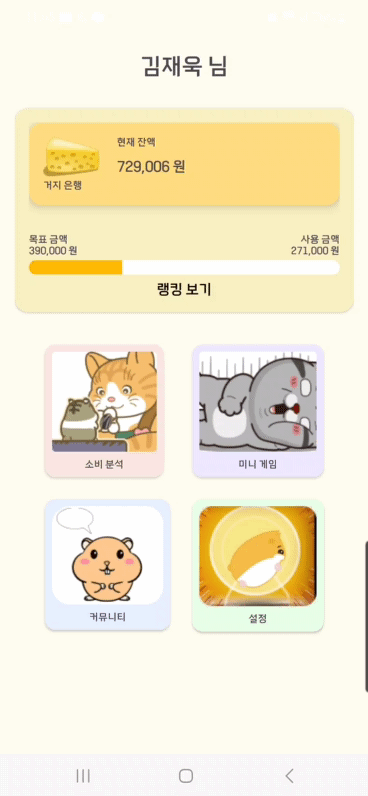
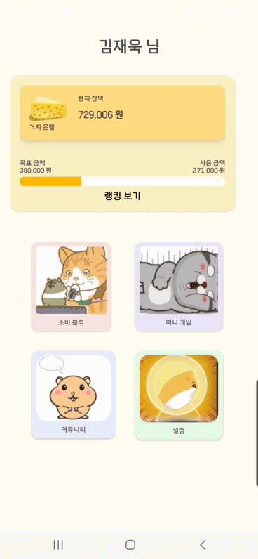
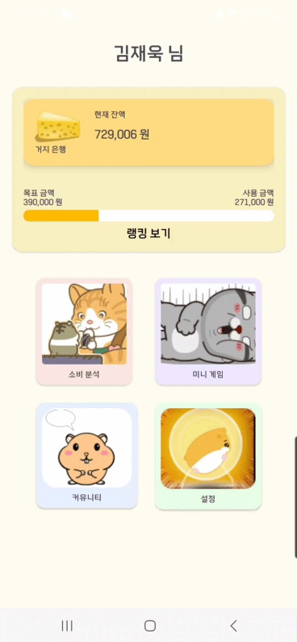

# 쥐금통 READEME

> ## 프로젝트 소개


- 소비 습관 개선 및 절약 문화 전파를 위한 앱
## **개발동기**

><h2>거지방 확장과 과소비 문화 축소를 위한 앱</h2>

    - 거지방의 채팅기능을 커뮤니티로 확장
    - 유니티로 개발된 게임을 통한 경쟁심 자극
    - 매 주 업데이트 되는 랭킹 시스템
    - 소비 패턴 분석

    

> ## 팀원 소개

    - 팀장 : 김준성(Front-end)
    - 팀원 : 손준배(Back-end)
    - 팀원 : 이현근(Back-end)
    - 팀원 : 김재욱(Back-end)
    - 팀원 : 김현지(Back-end)


>## **사용된 기술**
Frontend<br>
클린 아키텍처, RETROFIT, 멀티 모듈, 카카오 API, HILT, FIREBASE

Backend<br>
MVC패턴, REDIS 서버 사용, FIREBASE, 스케줄러, S3, 인터셉터, FasTexT, Gunicorn

Infra<br>
Docker, Jenkins, EC2, NGINX

<br><br>

## 기능 명세서
[기능명세서](https://spring-tsunami-dca.notion.site/2a16de673afb4e92a9214e8d272e07ee?pvs=4)
 

 ## ERD


 ## 배포 정보 
    
[포팅 메뉴얼](./exec/쥐금통_포팅_메뉴얼.docx)

 ## 프로젝트 트리
 ```

📦backend
 ┣ 📂.idea
 ┃ ┗ 📜...
 ┣ 📂giggyanalysis
 ┃ ┣ 📂.idea
 ┃ ┃ ┗ 📜...
 ┃ ┣ 📂giggyanalysis
 ┃ ┃ ┗ 📜...
 ┣ 📂giggyapp
 ┃ ┣ 📂gradle
 ┃ ┃ ┗ 📜...
 ┃ ┣ 📂src
 ┃ ┃ ┣ 📂main
 ┃ ┃ ┃ ┣ 📂java
 ┃ ┃ ┃ ┃ ┗ 📂com
 ┃ ┃ ┃ ┃ ┃ ┗ 📂d208
 ┃ ┃ ┃ ┃ ┃ ┃ ┗ 📂giggyapp
 ┃ ┃ ┃ ┃ ┃ ┃ ┃ ┗ 📜...
 ┣ 📂giggybank
 ┃ ┣ 📂gradle
 ┃ ┃ ┗ 📜...
 ┃ ┣ 📂src
 ┃ ┃ ┣ 📂main
 ┃ ┃ ┃ ┣ 📂java
 ┃ ┃ ┃ ┃ ┗ 📂com
 ┃ ┃ ┃ ┃ ┃ ┗ 📂d208
 ┃ ┃ ┃ ┃ ┃ ┃ ┗ 📂giggybank
 ┃ ┃ ┃ ┃ ┃ ┃ ┃ ┗ 📜...
 ┗ 📂giggyrank
   ┣ 📂gradle
   ┃ ┗ 📜...
   ┣ 📂src
   ┃ ┣ 📂main
   ┃ ┃ ┣ 📂java
   ┃ ┃ ┃ ┗ 📂com
   ┃ ┃ ┃ ┃ ┗ 📂d208
   ┃ ┃ ┃ ┃ ┃ ┗ 📂giggyrank
   ┃ ┃ ┃ ┃ ┃ ┃ ┗ 📜...

```

>## **미리보기**

### 절약랭킹

### 게임랭킹



### 거래내역


### 게시글


### 게임

### 소비패턴 분석

